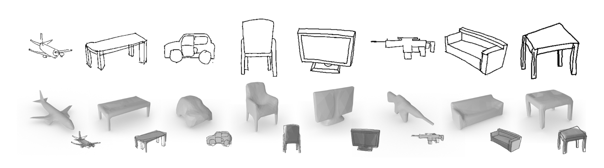

# Sketch2Model: View-Aware 3D Modeling from Single Free-Hand Sketches
### [Project Page](https://bennyguo.github.io/sketch2model/) | [Video](https://www.youtube.com/watch?v=wqGwcUKBG7E) | [Paper](https://arxiv.org/abs/2105.06663) | [Data](https://drive.google.com/drive/folders/1_DKZV6KtqpLKRoBd0JgOgf60wi1LYm6s?usp=sharing)
Official PyTorch implementation of paper `Sketch2Model: View-Aware 3D Modeling from Single Free-Hand Sketches`, presented at CVPR 2021. The code framework is adapted from [this CycleGAN repository](https://github.com/junyanz/pytorch-CycleGAN-and-pix2pix).

<!--  -->

## Environments
- `git clone --recursive https://github.com/bennyguo/sketch2model.git`
- Python>=3.6
- PyTorch>=1.5
- install dependencies: `pip install -r requirements.txt`
- build and install Soft Rasterizer: `cd SoftRas; python setup.py install`

## Training
- Download `shapenet-synthetic.zip` [here](https://drive.google.com/drive/folders/1_DKZV6KtqpLKRoBd0JgOgf60wi1LYm6s?usp=sharing), and extract to `load/`:
```
load/
└───shapenet-synthetic /
    │   02691156/
    │   ... ...
    ...
```
- Train on airplane:
```
python train.py --name exp-airplane --class_id 02691156
```

You may specify arguments listed in `options/base_options.py` and `options/train_options.py`. Saved meshes are named with the corresponding (ground truth or predicted) viewpoints in format `e[elevation]a[azimuth]`. `pred` in the filename indicates predicted viewpoint, otherwise the viewpoint is ground truth value (or user-specified when inference, see the Inference section below).

Supported classes:
```
02691156 Airplane
02828884 Bench
02933112 Cabinet
02958343 Car
03001627 Chair
03211117 Display
03636649 Lamp
03691459 Loudspeaker
04090263 Rifle
04256520 Sofa
04379243 Table
04401088 Telephone
04530566 Watercraft
```

## Evaluation
- Test on ShapeNet-Synthetic testset:
```
python test.py --name [experiment name] --class_id [class id] --test_split test
```
- To test on our ShapeNet-Sketch dataset, you need to first download `shapenet-sketch.zip` [here](https://drive.google.com/drive/folders/1_DKZV6KtqpLKRoBd0JgOgf60wi1LYm6s?usp=sharing) and extract to `load/`, then
```
python test.py --name [experiment name] --class_id [class id] --dataset_mode shapenet_sketch --dataset_root load/shapenet-sketch
```
About file structures of our ShapeNet-Sketch dataset, please see the dataset definition in `data/shapenet_sketch_dataset.py`.

## Inference
You can generate a 3D mesh from a given sketch image (black background, white strokes) with predicted viewpoint:
```
python infer.py --name [experiment name] --class_id [class id] --image_path [path/to/sketch]
```
or with specified viewpoint:
```
python infer.py --name [experiment name] --class_id [class id] --image_path [path/to/sketch] --view [elevation] [azimuth]
```
Note that elevation is in range [-20, 40], and azimuth is in range [-180, 180]. We provide some example sketches used in the paper in `load/inference`.

## Pretrained Weights
We provide pretrained weights for all the 13 classes, and weights trained with domain adaptation for 6 of them (airplane, bench, car, chair, rifle, sofa, table). You can download `checkpoints.zip` [here](https://drive.google.com/drive/folders/1_DKZV6KtqpLKRoBd0JgOgf60wi1LYm6s?usp=sharing) and extract to `checkpoints/`:
```
checkpoints/
└───airplane_pretrained/
└───airplane_pretrained+da/
└───... ...
```
Note that the code and data for domain adaptation are not contained in this repository. You may implement yourself according to the description in the original paper.

## Citation
```
@inproceedings{zhang2021sketch2model,
    title={Sketch2Model: View-Aware 3D Modeling from Single Free-Hand Sketches},
    author={Zhang, Song-Hai and Guo, Yuan-Chen and Gu, Qing-Wen},
    booktitle={Proceedings of the IEEE/CVF Conference on Computer Vision and Pattern Recognition},
    pages={6012--6021},
    year={2021}
}
```

## Contact
If you have any questions about the implementation or the paper, please feel free to open an issue or contact me at <guoyc19@mails.tsinghua.edu.cn>.